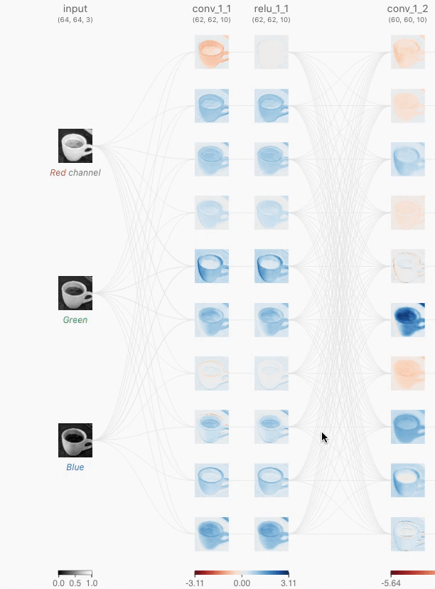
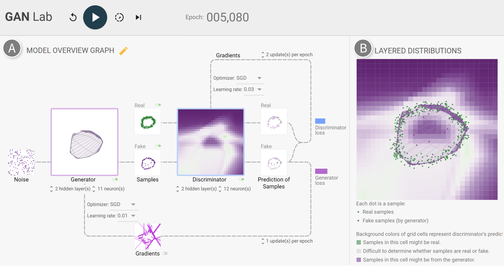

# VISxAI

This repository is a collection of interesting visualization work (VIS) in the domain of artificial intelligence (AI). As AI is getting applied to more and more domains, even crtitical ones, it is important to be able to understand the decisions that a model might make.

## Categories

As there is a lot of visualization work in the broad field of AI, the following subdivides this corpus into different application areas.

### Architecture Visualization

- [Net2Vis](#net2vis)
- [PlotNeuralNet](#plotneuralnet)

### Image-Based

- [CNN Explainer](#cnn-explainer)
- [Convnet Playground](#convnet-playground)

#### Attribution

#### Feature Visualization

- [Activation Atlas](#activation_atlas)
- [Building Blocks of Interpretability](#building_blocks_of_interpretability)
- [Circuits](#circuits)
- [Feature Visualization](#feature_visualization)
- [OpenAI Microscope](#openai-microscope)

### RNNs

- [exploRNN](#explornn)
- [Visualizing Memorization](#visualizing_memorization)

### GANs

- [GanLab](#ganlab)

### Reinforcement Learning

### Data

- [Training De-Confusion](#training-de-confusion)
- [Embedding Projector](#embedding-projector)

### Other

- [Tensorflow Playground](#tensorflow_playground)

## Details (Alphabetically)

This section shows the aforementioned tools in detail, providing a short explanation and helpful links.

### Activation Atlas

Interactive article on how to bring feature visualization into context to extract a bigger picture.

[Paper](https://distill.pub/2019/activation-atlas/)

### Building Blocks of Interpretability

Interactive article on how to make image classification more interpretable.

[Paper](https://distill.pub/2018/building-blocks/)

### Circuits

Interactive article on the reverse-engineering of neural network substructures.

[Paper](https://distill.pub/2020/circuits/)

### CNN Explainer

Educational tool that shows the inner workings of a Convolutional Neural Network.

[Live Demo](https://poloclub.github.io/ganlab/) | [Code](https://github.com/poloclub/cnn-explainer) | [Video](https://www.youtube.com/watch?v=HnWIHWFbuUQ&feature=youtu.be) | [Paper](https://arxiv.org/abs/2004.15004)

### Convnet Playground

A tool for the interactive exploration of Convolutional Neural Networks (Convnets or CNNs).

[Live Demo](https://convnetplayground.fastforwardlabs.com/#/)

### Embedding Projector

Showing high-dimensional data as low-dimensional embeddings.

[Live Demo](https://projector.tensorflow.org) | [Code](https://github.com/Sparkier/exploRNN)

### exploRNN

Educational tool for learning about recurrent neural networks (RNNs).

[Live Demo](https://mi-pages.informatik.uni-ulm.de/explornn/) | [Code](https://github.com/Sparkier/exploRNN) | [Paper](https://arxiv.org/abs/2012.06326)

### Feature Visualization

Optimizing the input image through backpropagation to obtain representative images for neurons or neuron clusters.

[Code](https://github.com/tensorflow/lucid) | [Paper](https://distill.pub/2017/feature-visualization/)

### GanLab

Educational tool that lets users experiment with GANs and how to train them.

[Live Demo](https://poloclub.github.io/ganlab/) | [Code](https://github.com/poloclub/ganlab) | [Paper](https://minsuk.com/research/papers/kahng-ganlab-vast2018.pdf)

### Net2Vis

Automatically obtaining overview visualizations for neural network architectures directly from Keras code.

[Live Demo](https://viscom.net2vis.uni-ulm.de) | [Code](https://github.com/viscom-ulm/Net2Vis) | [Paper](https://arxiv.org/abs/1902.04394)

### OpenAI Microscope

Feature Visualizations and other visualization techniques for many different architectures and neurons within them.

[Live Demo](https://microscope.openai.com/)

### PlotNeuralNet

Latex plugin to draw neural network figures.

[Code](https://github.com/HarisIqbal88/PlotNeuralNet)

### Tensorflow Playground

Interactive learning environment for training simple neural networks.

[Live Demo](https://playground.tensorflow.org/) | [Code](https://github.com/tensorflow/playground)

### Training De-Confusion

Using the trained classifier to find erroneously labeled samples in a dataset.

[Code](https://github.com/Sparkier/Classifier-Guided-Correction) | [Paper](https://diglib.eg.org/bitstream/handle/10.1111/cgf13973/v39i3pp195-205.pdf?sequence=1&isAllowed=y)

### Visualizing Memorization

Interactive article that shows how a RNN stores information over multiple time steps.

[Paper](https://distill.pub/2019/memorization-in-rnns/)

